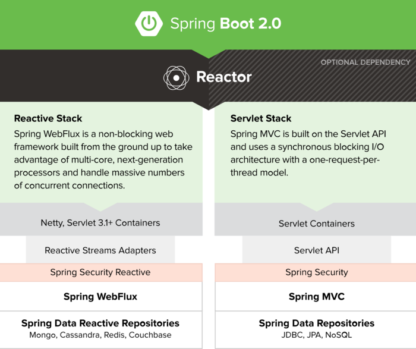

1. https://docs.spring.io/spring/docs/current/spring-framework-reference/web-reactive.html
2. https://medium.com/@the.raj.saxena/springboot-2-performance-servlet-stack-vs-webflux-reactive-stack-528ad5e9dadc

## 关键点

1. 非阻塞
2. 运行在servlet3.1 或者 netty（默认）
3. 传统的db不适用

| API Stack  | Sevlet Stack  | Reactive Stack |
|:------------- |:---------------:| -------------:|
|安全認證層|	Spring Security	| Spring Security                                    |
|數據訪問層|	Spring Data Repositories|	Spring Data Reactive Repositories      |
|容器API|	Servlet API |	Reactive Streams Adapters                              |
|內嵌容器	|Servlet Containers |	Netty, Servlet 3.1+ Containers                 |

### 优势

并发量更高

#

## 异步servlet3.1

### 同步

1. servlet阻塞了web容器的线程，web容器有线程数限制

### 异步

1. request.startAsync : AsyncContext
2. CompletableFuture.runAsync 在异步线程池中执行耗时任务

## SSE

> server send events

### server
1. response.setContentType("text/event-stream")
2. response.setCharacterEncoding("utf-8")
3. [可选]response.getWriter().write("event:tag\n\n");
3. response.getWriter().write("datexxxxx\n\n");
4. response.getWriter().flush()

### js
1. var sse = new EventSource("url")
2. sse.onmessage = function(e){
        console.log(e.data)   //会自动重连
    }
3. sse.addEventListener(tag,function(e){
        sse.close()
    })

